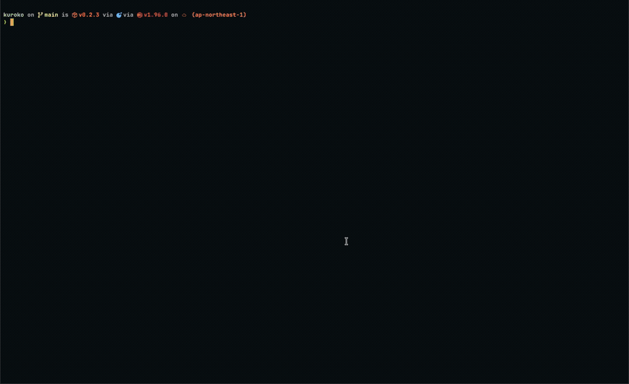
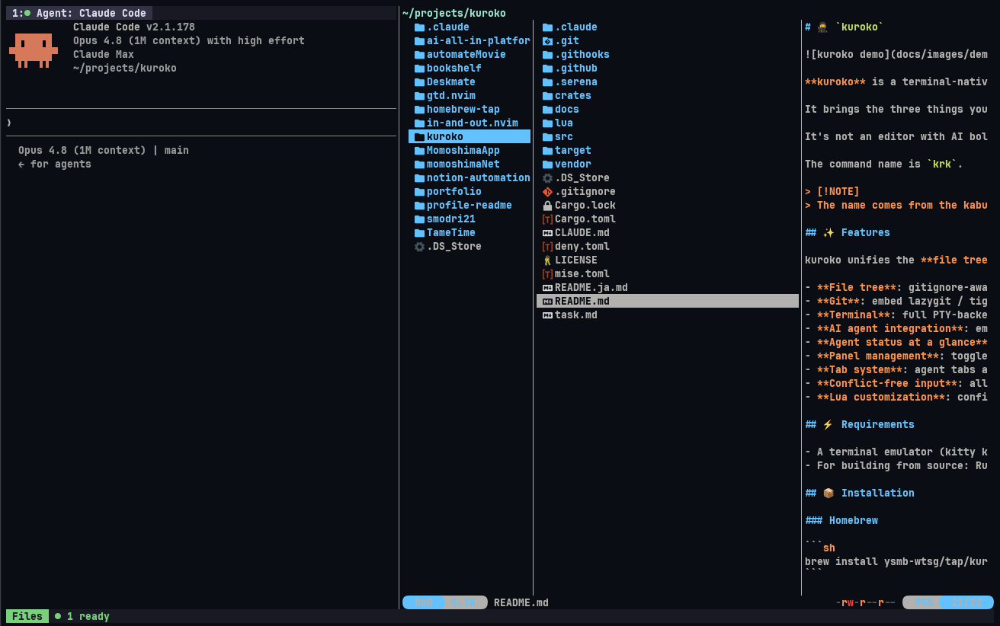
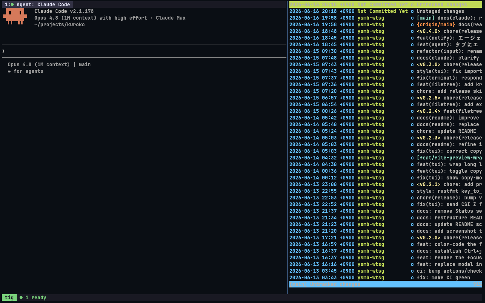
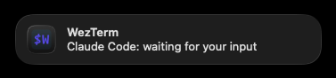
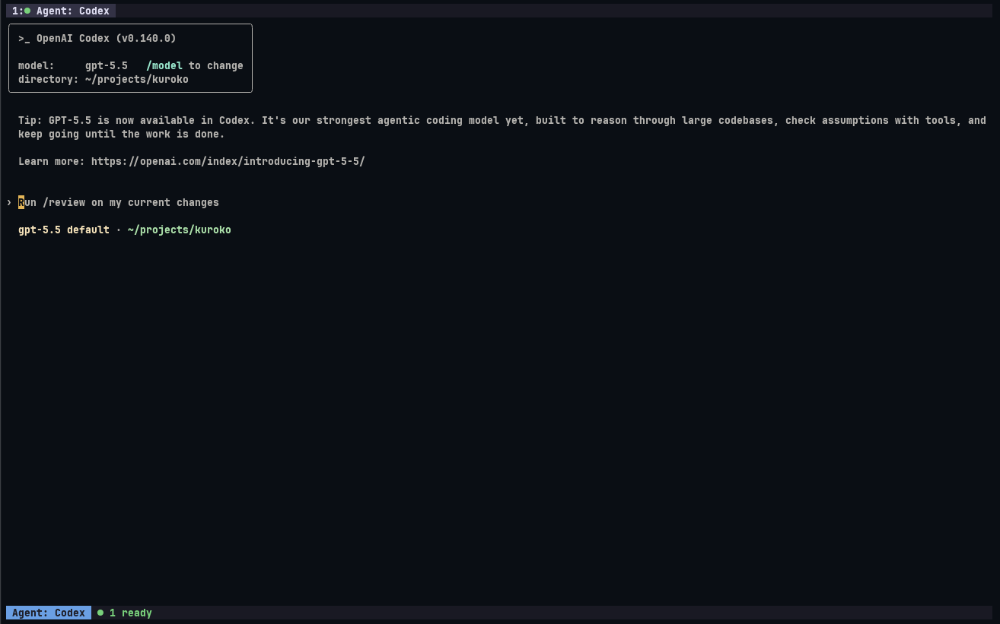

  # 🥷 `kuroko`

[English](README.md) | 日本語



**kuroko** はターミナルネイティブなIDEです。

## ✨ 特徴

- **ファイラ・Gitクライアント・ターミナルを内蔵**: kurokoを開くだけでシームレスな開発が可能です。
- **マルチエージェント実行**: エージェントペインはタブに対応。また、それぞれのタブの状況(入力待ち/完了)が一目でわかります。
- **Lua カスタマイズ**: `~/.config/krk/init.lua` でカスタマイズ可能。

## 📦 インストール

### Homebrew

```sh
brew install ysmb-wtsg/tap/kuroko
```

### ソースからビルド

```sh
git clone https://github.com/ysmb-wtsg/kuroko.git
cd kuroko
cargo build --release
```

Rust 1.96.0 以降が必要です。

## 🚀 使い方

```sh
krk
```

`Ctrl+g` を押すと **グローバルモード** に入り、ペインのリサイズ、フォーカスの移動などメタ的な操作が可能となります。
グローバルモードを解除するには`Ctrl+g`・`Esc`のいずれかを入力します。

### グローバルモードのキーバインド

| キー | 動作 |
|------|------|
| `h/j/k/l` | フォーカスの方向移動 |
| `Tab` / `Shift+Tab` | フォーカスを前 / 後ろへ循環 |
| `H/J/K/L` | ペインのリサイズ |
| `t` | ターミナルパネルのトグル |
| `f` | ファイルツリーパネルのトグル |
| `g` | git パネルのトグル |
| `Enter` | コピーモード（ターミナル / エージェントペイン） |
| `:` | コマンドパレット |
| `q` | 終了 |

### タブ操作（グローバルモード、フォーカス中のパネルに作用）

| キー | 動作 |
|------|------|
| `n` | 新しいタブを追加 |
| `x` / `w` | アクティブなタブを閉じる |
| `[` / `]` | 前 / 次のタブへ切り替え |
| `1-9` | 番号でタブを選択 |
| `r` | タブをリネーム |

## ⚙️ 設定

`~/.config/krk/init.lua` に設定ファイルを置くと、起動時に読み込まれます。

```lua
-- 利用可能な API
krk.pane.toggle(type)      -- パネルのトグル ("terminal", "files")
krk.pane.focus(direction)  -- フォーカス移動 ("next", "prev", "left", "right", "up", "down")
krk.opt.leader             -- リーダーキー
krk.opt.main_pane          -- メインペインの種類 ("claude-code", "codex", "terminal")
krk.opt.git_tool           -- git パネルのツール ("lazygit", "tig", "gitui" など)
krk.opt.file_manager       -- ファイラ ("yazi" など。未設定/"builtin" で内蔵ツリー)
krk.opt.notify             -- エージェント入力待ち時のデスクトップ通知 (デフォルト: true)
krk.opt.notify_message     -- 通知本文テンプレート ("{title}" = エージェント名)

-- キーバインド
-- context: "global"（グローバルモード内）| "direct"（ペインより前で横取り）
krk.keymap.set(context, key, callback)
krk.keymap.set_toggle_key(key)  -- グローバルモードのトグルキーを変更（デフォルト: "<C-g>"）
```

例——`Ctrl+h/j/k/l` で直接フォーカス移動:

```lua
for key, dir in pairs({ ["<C-h>"] = "left", ["<C-j>"] = "down", ["<C-k>"] = "up", ["<C-l>"] = "right" }) do
  krk.keymap.set("direct", key, function() krk.pane.focus(dir) end)
end
```

## 🎨 カスタマイズ

主要なパネルはサードパーティ製ツールに差し替えられます。いずれも `~/.config/krk/init.lua` で設定します。

### ファイラ

`krk.opt.file_manager` に起動コマンドを指定すると、ファイルツリーパネルを外部ファイラに差し替えます。

```lua
krk.opt.file_manager = "yazi"
```



未設定または `"builtin"` の場合は内蔵ファイルツリーを使います。指定したコマンドが見つからない場合は内蔵ツリーへフォールバックします。

### Git

`krk.opt.git_tool` に git クライアントを指定できます。

```lua
krk.opt.git_tool = "tig"
```



### 通知

エージェントが入力待ちになるとデスクトップ通知を出します。
`krk.opt.notify` で有効/無効を切り替え（デフォルト: `true`）、`krk.opt.notify_message` で本文テンプレートを設定します（`{title}` がエージェント名に置換されます）。



```lua
krk.opt.notify = true
krk.opt.notify_message = "{title}: 入力待ちです"
```

### エージェント

`krk.opt.main_pane` でメインペインに据えるエージェントを選びます。



```lua
krk.opt.main_pane = "codex"
```

## 💡 着想

AIエージェント駆動の vibe coding は、もはやファイル閲覧・編集を必要としません。
開発者は従来のパラダイム——エディタを中心に据えAIエージェントをゲストとして迎え入れる——から脱却し、AIエージェントを中心に据えた新しい価値観にパラダイムシフトしつつあります。
`kuroko`はこの新しいパラダイムを具現化した、新時代のIDEです。

> [!NOTE]
> 名前は歌舞伎の「黒子（くろこ）」に由来します。黒子は観客が「見えないもの」として扱う黒装束の裏方です。
> kuroko は vibe coding を支える「黒い画面」の裏方です。

## 📄 ライセンス

MIT
