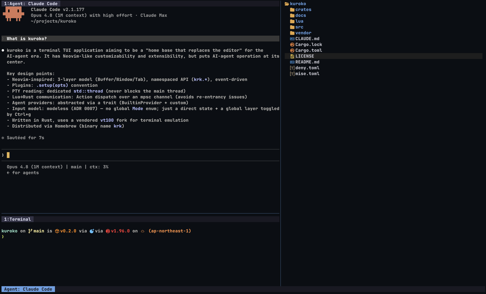

# 🥷 `kuroko`



**kuroko** is a terminal TUI that aims to be the home base that replaces the editor in the AI agent era. The command name is `krk`.

It keeps the customizability and extensibility of Neovim, while putting AI agent operation at the center.

> [!NOTE]
> The name comes from the kabuki *kuroko* (黒子) — the black-clad stagehand the audience agrees not to see. AI agents stand between you and the code, veiling the source like a kuroko — on the "black screen" of your terminal.

## ✨ Features

- **AI agent integration**: Embed Claude Code, Codex, and custom agents via PTY
- **Panel management**: Toggle and resize file tree, terminal, and git panels
- **Tab system**: Agent tabs and terminal tabs managed independently
- **Conflict-free input**: All keys go straight to the focused pane; pane management lives in a global layer behind `Ctrl+g`
- **Lua customization**: Configure via `~/.config/krk/init.lua`
- **Git panel**: Embed external tools such as lazygit / tig / gitui in the right panel
- **File tree**: gitignore-aware, file operations (create / rename / delete), preview

## ⚡️ Requirements

- A terminal emulator (kitty keyboard protocol recommended for `Shift+Enter`)
- For building from source: Rust 1.96.0 or later

## 📦 Installation

### Homebrew

```sh
brew install ysmb-wtsg/tap/kuroko
```

### Build from source

Requires Rust 1.96.0 or later (managing with [mise](https://mise.jdx.dev/) is recommended).

```sh
git clone https://github.com/ysmb-wtsg/kuroko.git
cd kuroko
cargo build --release
```

The binary is generated at `target/release/krk`.

## 🚀 Usage

```sh
krk
```

By default every key — including `Esc` and `Ctrl` combinations — goes straight to the focused pane, so tools running inside (vim, Claude Code, fzf, ...) behave exactly as they would in a plain terminal.

Press `Ctrl+g` to enter the **global layer**, where single keystrokes manage panes. Press `Ctrl+g`, `Esc`, or `i` to go back to direct input. The status bar shows a `GLOBAL` badge while the layer is active.

> [!TIP]
> In an agent / terminal pane, `Enter` submits and **`Ctrl+j` inserts a newline** for multi-line input. `Shift+Enter` and `Alt+Enter` also insert a newline on terminals that report them (kitty keyboard protocol); since many terminals cannot distinguish `Shift+Enter` from `Enter`, `Ctrl+j` is the portable shortcut.

### Global layer keybindings

| Key | Action |
|------|------|
| `h/j/k/l` | Directional focus movement |
| `Tab` / `Shift+Tab` | Cycle focus forward / backward |
| `H/J/K/L` | Resize panes |
| `t` | Toggle terminal panel |
| `f` | Toggle file tree panel |
| `g` | Toggle git panel |
| `Enter` | Copy mode (terminal / agent pane) |
| `:` | Command palette |
| `q` | Quit |

### Tab operations (global layer, act on the focused panel)

| Key | Action |
|------|------|
| `n` | Add a new tab |
| `x` / `w` | Close the active tab |
| `[` / `]` | Switch to previous / next tab |
| `1-9` | Select tab by number |
| `r` | Rename tab |

## ⚙️ Configuration

Place a config file at `~/.config/krk/init.lua` and it is loaded on startup.

```lua
-- Available APIs
krk.pane.toggle(type)      -- Toggle a panel ("terminal", "files")
krk.pane.focus(direction)  -- Move focus ("next", "prev", "left", "right", "up", "down")
krk.opt.leader             -- Leader key
krk.opt.main_pane          -- Main pane type ("claude-code", "codex", "terminal")
krk.opt.git_tool           -- Git panel tool ("lazygit", "tig", "gitui", etc.)

-- Keybindings
-- context: "global" (inside the global layer) | "direct" (intercepted before the pane)
krk.keymap.set(context, key, callback)
krk.keymap.set_toggle_key(key)  -- Change the global layer toggle (default: "<C-g>")
```

Example — direct `Ctrl+h/j/k/l` focus movement:

```lua
for key, dir in pairs({ ["<C-h>"] = "left", ["<C-j>"] = "down", ["<C-k>"] = "up", ["<C-l>"] = "right" }) do
  krk.keymap.set("direct", key, function() krk.pane.focus(dir) end)
end
```

> [!WARNING]
> Binding keys in the `direct` context steals them from apps running inside panes. Prefer the `global` context unless you specifically want a key to bypass the focused tool.

## 🧩 Tech stack

- **Language**: Rust (edition 2024)
- **TUI**: ratatui 0.30 + crossterm
- **PTY**: portable-pty + vt100
- **Plugins**: Lua 5.4 (mlua, vendored)

## 🚧 Status

v0.2.0 — modeless input (global layer), pane management, agent integration, and Lua configuration are working.

Planned:
- Session persistence (tabs)
- Theme customization

## 📄 License

MIT
